# Examples Directory Structure

This directory contains organized examples demonstrating different approaches to using MLServer FastAPI Wrapper.

## Structure

### 📁 `example_titanic_manual_setup/`
**Complete manual setup example** - demonstrates the traditional approach where you manually create all configuration files.

**Contents:**
- `mlserver.yaml` - Server and predictor configuration
- `predictor_catboost.py` - Custom predictor class implementation
- `requirements.txt` - Python dependencies
- `Dockerfile` - Container configuration
- `.dockerignore` - Container build exclusions
- `artifacts/` - Pre-trained model artifacts (preprocessor, model, feature order)

**Use Case:**
- When you have an existing trained model and want full control over configuration
- For production deployments where you need customized predictor logic
- Educational purposes to understand MLServer components

**Quick Start:**
```bash
cd example_titanic_manual_setup/
ml_server serve mlserver.yaml
```

### 📁 `example_titanic_raw/`
**Raw notebook example** - demonstrates the AI-powered initialization workflow.

**Contents:**
- `train_titanic.py` - Training script that creates model artifacts
- `inference_example.ipynb` - Jupyter notebook with inference examples and predictor patterns

**Use Case:**
- Starting point for the `ml_server ainit` command (coming soon!)
- When you have a Jupyter notebook with inference code and want to auto-generate MLServer configuration
- Rapid prototyping and development workflow

**Future Workflow (AI-Init):**
```bash
cd example_titanic_raw/
ml_server ainit --file inference_example.ipynb
# ⬆️ This will auto-generate all the files from example_titanic_manual_setup/
```

### 📁 Root Level Files
Legacy files maintained for backward compatibility:
- `mlserver.yaml` - Main configuration (symlinked to manual_setup)
- `predictor_catboost.py` - Main predictor (symlinked to manual_setup)
- `train_titanic.py` - Training script
- `load_test_demo.py` - Performance testing demo
- `README.md` - Detailed usage documentation

## AI-Init Vision

The `ml_server ainit` command (currently in development) will bridge the gap between the two approaches:

```mermaid
graph LR
    A[📓 Jupyter Notebook<br/>inference_example.ipynb] --> B[🤖 AI Analysis<br/>ml_server ainit]
    B --> C[📁 Generated Files<br/>mlserver.yaml<br/>predictor_*.py<br/>requirements.txt<br/>Dockerfile]
    C --> D[🚀 Production Ready<br/>ml_server serve]
```



### How AI-Init Will Work

1. **Analyze** the notebook to extract:
   - Model loading patterns
   - Preprocessing pipelines
   - Feature engineering logic
   - Prediction methods
   - Required dependencies

2. **Generate** configuration files:
   - `mlserver.yaml` with auto-detected settings
   - Predictor class with extracted logic
   - `requirements.txt` with detected dependencies
   - `Dockerfile` for containerization

3. **Validate** the generated configuration:
   - Syntax checking
   - MLServer compatibility
   - Dependency verification
   - Artifact validation

4. **Interactive setup** with user guidance:
   - Configuration customization
   - Error resolution help
   - Best practice suggestions

## Migration Path

**Current State:** Manual configuration (example_titanic_manual_setup)
**Target State:** AI-powered generation (example_titanic_raw → automated setup)

**Benefits of AI-Init:**
- ✅ **Zero manual configuration** - Auto-generate all required files
- ✅ **Framework agnostic** - Support sklearn, CatBoost, PyTorch, etc.
- ✅ **Best practices** - Generated code follows MLServer patterns
- ✅ **Interactive guidance** - User-friendly setup experience
- ✅ **Validation** - Ensure configurations work before deployment

## Getting Started

### For Manual Setup (Available Now)
```bash
cd examples/example_titanic_manual_setup/
ml_server serve
```

### For AI-Init Workflow (Coming Soon!)
```bash
cd examples/example_titanic_raw/
ml_server ainit --file inference_example.ipynb
ml_server serve
```

See individual README files in each subdirectory for detailed instructions.